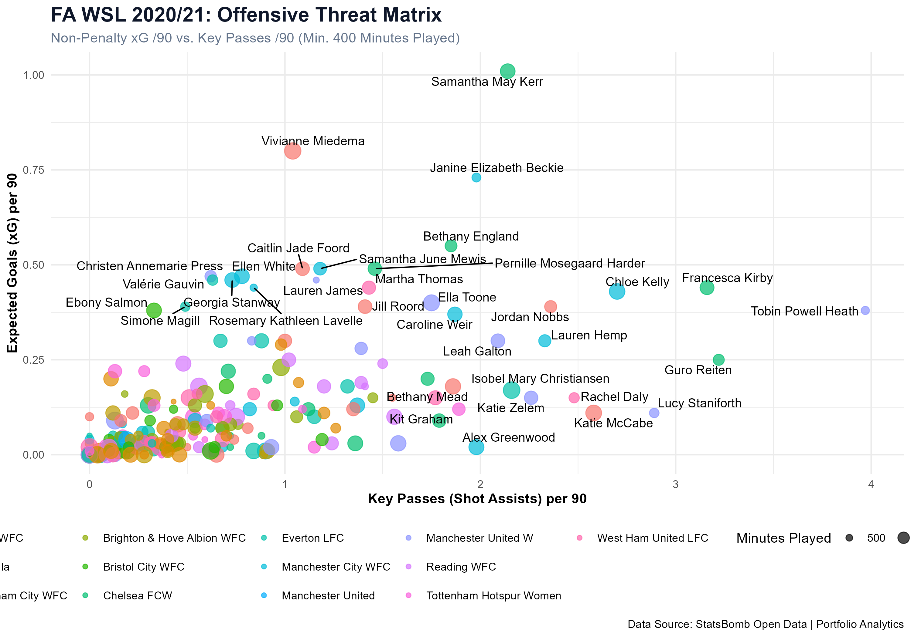

# ⚽ WSL  Football Analytics Portfolio

[](https://ejh-analysis.shinyapps.io/wsl-scouting-explorer/)
[](https://www.r-project.org/)
[](https://statsbomb.com/)
[](LICENSE)

A centralised repository featuring modular end-to-end sports analytics projects, data engineering pipelines, and interactive scouting applications.

---

## 📌 Repository Architecture

```text
football-analytics-portfolio/
│
├── StatsBomb_Dashboard_1/          # FA WSL Scouting & Metric Matrix
│   ├── Analysis.R                  # Ingestion, Feature Engineering, & Static Visuals
│   ├── app.R                       # Optimised Production Shiny Application
│   └── players_data.rds            # Serialised Per-90 Aggregate Cache
│
├── wsl_offensive_threat_matrix.png  # High-resolution static visual artifact
├── README.md                       # Project documentation
└── football-analytics-portfolio.Rproj
```
## 🛠️ Data Pipeline & Engineering

```text
[StatsBomb API]
       │
       ▼  (FreeMatches / free_allevents)
[Analysis.R] ─── ETL, Per-90 Normalisation ───► [wsl_offensive_threat_matrix.png]
       │
       ▼  (saveRDS serialisation)
[players_data.rds] (Low-footprint data binary)
       │
       ▼  (readRDS on container boot)
[app.R (Shiny)] ─── Dynamic Filtering & Plotly Rendering ───► [User Client]
```
## 📊 Analytical Visualisations

### FA WSL 2020/21: Offensive Threat Matrix
Non-Penalty Expected Goals (npxG) per 90 vs. Key Passes per 90 (Minimum 400 Minutes Played):



* **Top-Right Quadrant:** Identifies primary dual-threat creators combining both elite goal threat and shot-creation volume.
* **Point Size:** Scaled by cumulative minutes played across the season.